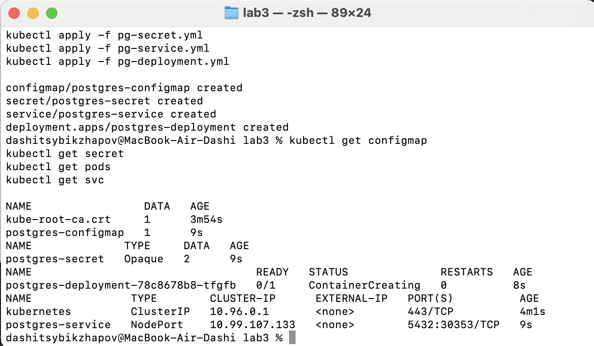
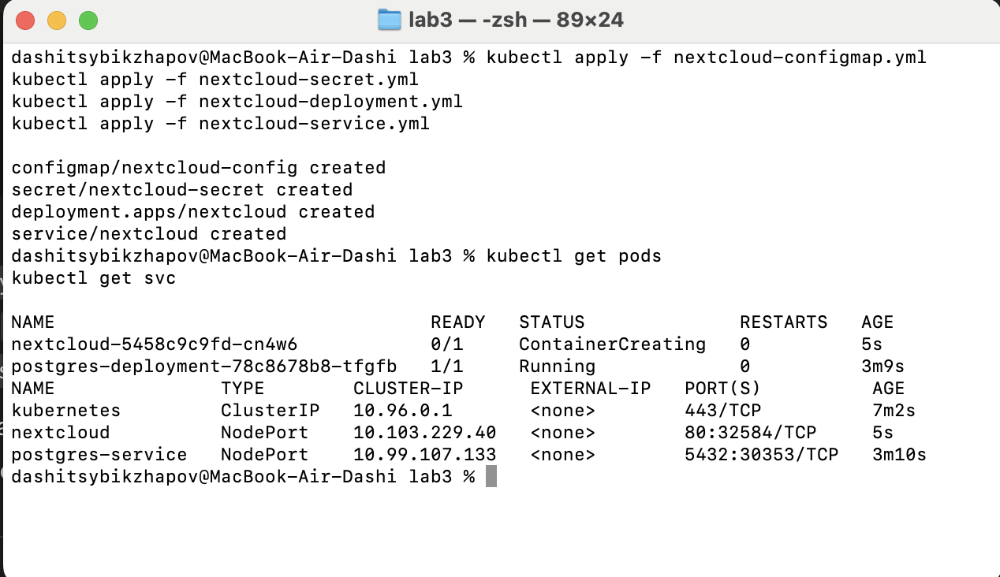
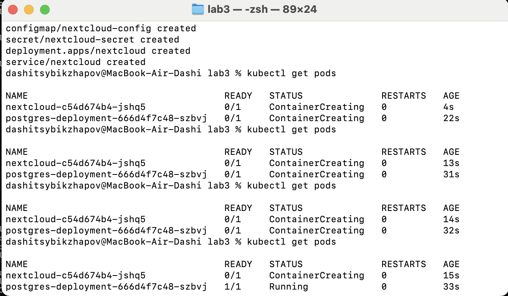
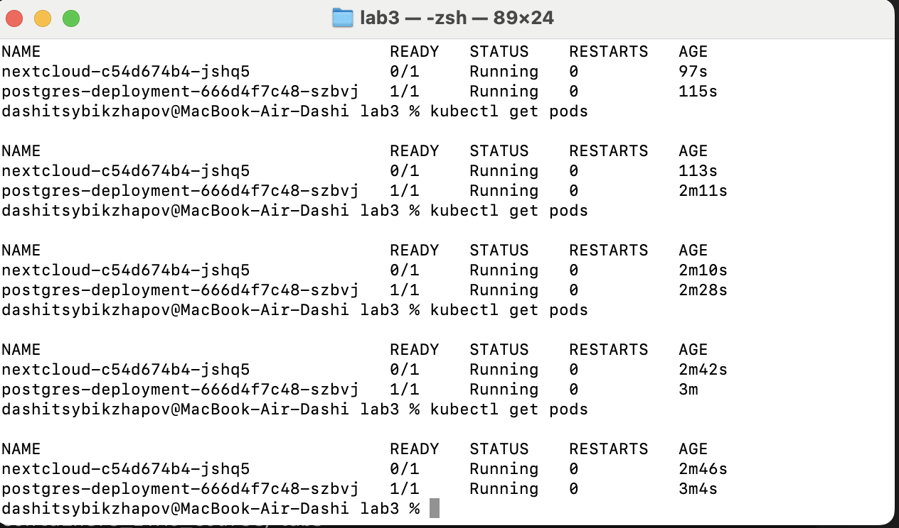

# Kubernetes (minikube + Nextcloud)

Поднял локальный кластер Kubernetes 
с помощью minikube и развернул в нём связку 
**PostgreSQL + Nextcloud**. 
Для описания ресурсов использовал отдельные манифесты 
(ConfigMap, Secret, Service, Deployment).

## Часть 1. Установка и запуск minikube

1. Установил и запустил Docker Desktop, проверил, что `docker ps` работает.
2. Установил `kubectl` и `minikube` (по инструкции из методички).
3. Проверка установки:
```bash
minikube version
kubectl version --client
```
4. Запуск minikube:
```bash
minikube start
```
5. Проверка, что кластер поднялся:
```bash
kubectl config current-context   # должен быть minikube
docker ps                        # должен появиться контейнер minikube
```

## Часть 2. Создание объектов в Kubernetes

Все манифесты лежат в папке lab3/:
- pg-configmap.yml
- pg-secret.yml
- pg-service.yml
- pg-deployment.yml
- nextcloud-configmap.yml
- nextcloud-secret.yml
- nextcloud-deployment.yml
- nextcloud-service.yml

Создание ресурсов:
```text
kubectl apply -f pg-configmap.yml
kubectl apply -f pg-secret.yml
kubectl apply -f pg-service.yml
kubectl apply -f pg-deployment.yml

kubectl apply -f nextcloud-configmap.yml
kubectl apply -f nextcloud-secret.yml
kubectl apply -f nextcloud-deployment.yml
kubectl apply -f nextcloud-service.yml
```
Проверка:
```text
kubectl get configmap
kubectl get secret
kubectl get pods
kubectl get svc
```

## Вопрос: важен ли порядок применения манифестов?

Формально Kubernetes создаёт объекты независимо, так что kubectl apply -f . сработает: 
если Pod не найдёт ConfigMap или Secret, он будет падать в CreateContainerConfigError, 
но kubelet будет постоянно пытаться перезапустить его, 
пока нужные объекты не появятся.
На практике удобнее придерживаться порядка:
- ConfigMap / Secret
- Deployment
- Service

Тогда Pod сразу стартует нормально и в логах меньше “шума”.

## Часть 3. Доступ к Nextcloud

1. Открыть сервис через minikube
```bash
minikube service nextcloud
```
Команда поднимает туннель от ноутбука до 
NodePort-сервиса nextcloud,
открывает браузер с адресом http://127.0.0.1:xxxxx.

Логин/пароль для входа:
- NEXTCLOUD_ADMIN_USER — из nextcloud-secret.yml
- NEXTCLOUD_ADMIN_PASSWORD — из nextcloud-secret.yml

2. Dashboard (доп. задание)
```bash
minikube dashboard --url
```
Команда выводит URL веб-дэшборда. 
Его можно открыть в браузере и посмотреть все созданные объекты (Pods, Deployments, Services, ConfigMaps, Secrets и т.д.).

## Вопрос: Что будет, если отскейлить postgres-deployment в 0, потом обратно в 1, и снова зайти на Nextcloud?

Последовательность:
```bash
kubectl scale deployment postgres-deployment --replicas=0
kubectl get pods     # подов postgres нет

# потом:
kubectl scale deployment postgres-deployment --replicas=1
kubectl get pods     # под postgres снова появился
```
Пока postgres в 0 репликах:
Pod с БД отсутствует, поэтому Nextcloud не может подключиться к базе.
В браузере при открытии Nextcloud будут ошибки соединения с БД.
Когда масштабируем обратно в 1:
под postgres поднимается заново, подключается к тому же диску (volume/PVC, который описан в deployment’е);
все данные в БД сохраняются, т.к. они лежат на постоянном хранилище, а не внутри контейнера;
Nextcloud через несколько секунд снова начинает нормально работать с теми же пользователями и настройками.
Если бы данные БД хранились только в файловой системе контейнера (без volume), то при скейле в 0 мы бы потеряли всё содержимое и при старте с 1 репликой Nextcloud увидел бы “чистую” БД.

## Вопрос про перенос POSTGRES_USER / POSTGRES_PASSWORD из ConfigMap в Secret

В примере юзер и пароль хранились в ConfigMap. В моей версии:
- для Postgres используется postgres-configmap с только POSTGRES_DB;
- отдельно создан postgres-secret с логином и паролем;
- Deployment postgres-deployment подтягивает значения через envFrom из ConfigMap и Secret.
Так конфиденциальные данные (логин/пароль) уже не лежат в открытом виде в ConfigMap и чуть лучше защищены (хранятся в объекте типа Secret).

## Вопрос про перенос переменных Nextcloud в ConfigMap + пробы
Для Nextcloud вынесены почти все “обычные” переменные окружения в ConfigMap `nextcloud-config`:
- NEXTCLOUD_UPDATE
- ALLOW_EMPTY_PASSWORD
- NEXTCLOUD_TRUSTED_DOMAINS
- POSTGRES_HOST

Deployment подхватывает их через `envFrom`.

Учётные данные админа:
- `NEXTCLOUD_ADMIN_USER`
- `NEXTCLOUD_ADMIN_PASSWORD`
вынесены в отдельный Secret `nextcloud-secret`, откуда также подтягиваются через `envFrom`.

Также в Deployment добавлены:
- **livenessProbe** — проверяет, что контейнер живой, дергая `GET /status.php`;
- **readinessProbe** — показывает, готов ли pod принимать трафик (пока Nextcloud инициализируется, pod не попадает за сервис).

### Nextcloud полностью не запускается

У меня контейнер Nextcloud успешно разворачивается и подключается к базе данных PostgreSQL, но в логах периодически появляется ошибка:

`SQLSTATE[42501]: Insufficient privilege: 7 ERROR: permission denied for table oc_migrations`

Из-за этого nextcloud-c54d674b4-tlz54 бесконечно перезапускается
Попытался пофиксить, но к сожалению не смог





